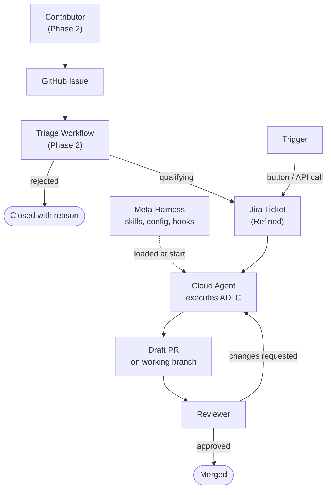
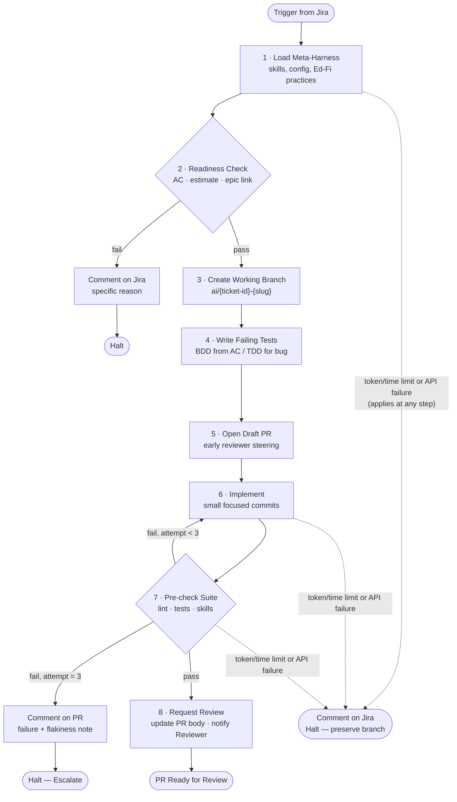
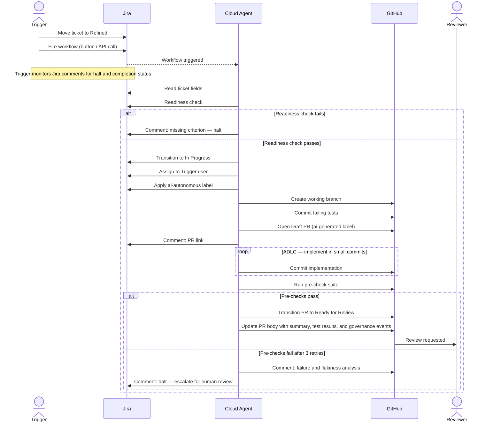

# PRD: Agentic Workflows for Fiona Development

> **Status:** draft \
> **Owner:** Robert Hunter \
> **Parent document:** [Fiona Slack PRD](PRD-Fiona-slack.md) \
> **Jira Project:** AI \
> **Repository:** `Ed-Fi-Alliance-OSS/Fiona` (monorepo)

The keywords **must**, **should**, and **may** in this document follow RFC 2119 conventions.
"Must" denotes a binding requirement. "Should" denotes a strong recommendation with recognized
exceptions. "May" denotes an optional capability.

## Table of Contents

1. [Overview](#1-overview)
   - 1.1 [Strategic Alignment](#11-strategic-alignment)
   - 1.2 [User Roles](#12-user-roles)
   - 1.3 [Jobs to be Done](#13-jobs-to-be-done-jtbd)
   - 1.4 [Inspiration](#14-inspiration)
2. [System Context](#2-system-context)
3. [Functional Requirements](#3-functional-requirements)
   - 3.1 [Cross-Cutting Concerns](#31-cross-cutting-concerns)
   - 3.2 [Agentic Development Life Cycle](#32-agentic-development-life-cycle-adlc)
   - 3.3 [Agent–Jira Contract](#33-agentjira-contract)
   - 3.4 [Agent–GitHub Contract](#34-agentgithub-contract)
   - 3.5 [Failure Modes and Recovery](#35-failure-modes-and-recovery)
   - 3.6 [Bug Fix Workflow](#36-bug-fix-workflow)
   - 3.7 [New Feature Workflow](#37-new-feature-workflow)
   - 3.8 [Tech Debt Workflow](#38-tech-debt-workflow)
   - 3.9 [Dependabot Workflow](#39-dependabot-workflow)
   - 3.10 [Observability Workflow](#310-observability-workflow)
   - 3.11 [Feedback Loop (Phase 2 stub)](#311-feedback-loop-phase-2--stub)
   - 3.12 [Issue Triage (Phase 2 stub)](#312-issue-triage-workflow-phase-2--stub)
4. [Non-Functional Requirements](#4-non-functional-requirements)
5. [Out of Scope](#5-out-of-scope)
6. [Open Questions](#6-open-questions)
7. [Development Phases](#7-development-phases)
8. [Success Metrics](#8-success-metrics)
9. [Glossary](#9-glossary)

## 1. Overview

This document defines the requirements for an agentic development platform on the Fiona repository.
The platform enables the internal product team — and eventually the broader community — to delegate
software development tasks to cloud agents using natural language specifications, without babysitting
an IDE, steering a chat session, or maintaining local compute.

This platform is an implementation of **Agentic Loop Engineering**: a shift from automation built
on deterministic, sequential steps to systems built on loops — cycles of reasoning, action, and
observation that continue until a governance condition terminates them. The analogy to recursion is
useful: just as recursion trades simplicity and stack predictability for expressive power, agentic
loops trade determinism for flexibility. And just as unbounded recursion causes call-stack explosion,
agentic loops without guardrails cause token and cost explosion. The governance layer is the base
case.

The agent in these workflows is the combination of a model and a harness. What this platform
engineers is the layer above that: the **meta-harness** — the collection of skills, configuration
files, hooks, and agent definitions that load context, enforce practices, and shape how the agent
reasons. Previously, a developer would guide an agent interactively, effectively playing the factory.
This platform shifts the developer into the role of **factory operator**: designing and tuning the
system that runs the factory, rather than running it personally.

The result is a workflow that product owners and community contributors can steer with natural
language (through a refined Jira ticket), which the agent executes from ticket to Draft PR with
minimal human oversight.

### 1.1 Strategic Alignment

Developer time on the Fiona project is constrained. Routine implementation tasks — bug fixes, minor
features, dependency updates, tech debt remediation — consume cycles that could be directed toward
system architecture, meta-harness design, and governance. Cloud-based agentic workflows address this
directly: a human verifies that a ticket is ready for work, kicks off the pipeline from Jira, and
returns when there is a PR to review.

The longer-term goal is a platform that product owners and community contributors alike can use to
steer development with natural language. Specifications in a refined ticket, combined with the
meta-harness (model, skills, best-practice configuration), drive the Agentic Development Life Cycle
(ADLC) from ticket to Draft PR. This reduces time spent on implementation details and frees it for
the higher-order work of designing the systems that govern agents.

A secondary output of operating this platform is the accumulation of observability data: links
between agent actions, code quality outcomes, and reviewer feedback. This data feeds back into
meta-harness improvement — better skills, better configuration, better governance. The platform
learns from its own operation over time.

### 1.2 User Roles

| Role | Description | Phase |
| ---- | ----------- | ----- |
| **Product Owner** | Defines acceptance criteria, approves ticket refinement, and sets the direction for what gets built. Currently the primary stakeholder for MVP and Phase 1. | MVP |
| **Operator** | Engineers and maintains the meta-harness: skills, `CLAUDE.md`, hooks, and agent configuration. Monitors observability telemetry and tunes governance policies. The Operator is the factory designer. | MVP |
| **Trigger** | Any core team member who moves a ticket to "Refined" status and fires the workflow from Jira. The Trigger and Reviewer may be the same person or different people. | MVP |
| **Reviewer** | Any core team member who reviews and approves (or requests changes on) an agent-produced Draft PR before merge. | MVP |
| **Contributor** | A community member who submits a GitHub Issue that enters the triage pipeline. Reviewers may eventually include trusted Contributors. | Phase 2 |

In MVP and Phase 1, the Product Owner, Operator, and Trigger roles are held by the same small core
team. As the platform matures, these roles will be held by distinct individuals.

### 1.3 Jobs to be Done (JTBD)

**JTBD-BUG**: When a bug ticket reaches "refined" status in Jira, I want to trigger a cloud agent
from the ticket that reproduces the bug, implements a fix with tests following TDD/BDD practices,
and opens a Draft PR with all pre-checks passing, so that I can review a complete, verified solution
without consuming local development time or steering the agent interactively.

**JTBD-FEAT**: When a feature ticket with acceptance criteria reaches "refined" status in Jira, I
want to trigger a cloud agent from the ticket that implements the feature using BDD/TDD practices
and opens a Draft PR with all pre-checks passing, so that I can review production-ready code without
blocking other work.

**JTBD-TECH**: When a tech debt ticket reaches "refined" status in Jira, I want to trigger a cloud
agent from the ticket that implements the remediation and opens a Draft PR with all pre-checks
passing, so that maintenance work does not compete with feature development for developer attention.

**JTBD-DEP**: When a Dependabot PR is opened for a patch or minor version update, I want a cloud
agent to validate compatibility, run the pre-check suite, and auto-merge if all checks pass, so that
dependency hygiene is maintained without manual intervention. For major version updates, the agent
escalates for human review.

**JTBD-OBS**: When a workflow executes, I want telemetry linking agent actions to code quality
outcomes and pre-check results, so that I can observe the effectiveness of the meta-harness and
identify improvements to skills, configuration, and governance policies.

**JTBD-FEEDBACK** *(Phase 2 — stub)*: When a reviewer comments on an agent-produced PR, I want
those comments to be captured and used to refine skills and configuration, so that the agent handles
similar issues better in future runs and the meta-harness improves continuously.

**JTBD-TRIAGE** *(Phase 2 — stub)*: When a GitHub Issue is submitted by a community contributor, I
want an automated triage workflow to classify and route qualifying issues into the Jira pipeline, so
that community contributions can enter the development workflow without requiring manual review for
each submission. Detailed design is deferred to a separate document (see Section 3.12).

### 1.4 Inspiration

The following links may offer inspiration for the identification and development of these workflows:

- <https://github.com/github/gh-aw>
- <https://github.com/github/copilot-sdk/blob/main/.github/agents/agentic-workflows.agent.md>
- <https://github.com/github/gh-aw-actions/blob/main/.github/workflows/agentics-maintenance.yml>
- <https://github.com/github/awesome-copilot/tree/main/agents>
- <https://github.com/github/copilot-cli/blob/main/.github/workflows/feature-request-comment.yml>
- <https://github.com/github/copilot-cli/blob/main/.github/workflows/no-response.yml>
- <https://github.com/dotnet/runtime/tree/main/.github/agents>
- <https://github.com/anthropics/claude-code/blob/main/.github/workflows/claude-dedupe-issues.yml>
- <https://github.com/anthropics/claude-code/blob/main/.github/workflows/claude-issue-triage.yml>
- <https://github.com/anthropics/claude-code/blob/main/.github/workflows/lock-closed-issues.yml>

Skills may be adopted from <https://github.com/addyosmani/agent-skills> (credit to be given in
`NOTICES.md`).

## 2. System Context

Two pipelines feed work into the agentic workflows:

**MVP / Phase 1 — Jira pipeline (core team):** A Trigger refines a Jira ticket and fires the
workflow directly from the ticket via a button or API call. The agent loads the meta-harness
(Ed-Fi best practices, relevant skills, configuration), performs a lightweight readiness check,
executes the ADLC autonomously on a dedicated working branch, and opens a Draft PR. A Reviewer
reviews the PR. Local compute is not required during execution. Delivery begins with an MVP scoped
to the bug fix workflow before expanding to the full workflow suite.

**Phase 2 — GitHub Issue pipeline (community):** A Contributor opens a GitHub Issue. An automated
triage step classifies the issue, validates it, and promotes qualifying issues into the Jira
pipeline as refined tickets. From that point, the Phase 1 workflow applies. Detailed design for
this pipeline is deferred to a separate document.

The boundary of agent responsibility is: ticket in "Refined" status → Draft PR open on a working
branch with pre-checks passing → Reviewer notified. The agent does not deploy, does not merge, and
does not perform code review. Governance policies regulate loop termination throughout execution.

Observability telemetry is emitted throughout the workflow, linking actions to outcomes and feeding
back into meta-harness improvement over time (see JTBD-OBS, JTBD-FEEDBACK).

## 3. Functional Requirements

### 3.1 Cross-Cutting Concerns

**FR-CROSS-1**: All workflows must have consistent error handling and logging so that failures and
significant events are captured and analyzable across workflows. Basic error logging sufficient to
diagnose failures is an MVP expectation; structured, consistent cross-workflow error handling and
logging is a Phase 1 requirement.

**FR-CROSS-2 — Authentication and Authorization**: All workflows must use the authentication
mechanism appropriate to each external system. These mechanisms must not be mixed across systems.
At minimum:

- **GitHub API**: authenticate via GitHub Actions `GITHUB_TOKEN` or a scoped personal access token
  stored as a GitHub Actions secret.
- **Jira API**: authenticate via a Jira API token stored as a GitHub Actions secret.
- **Azure or other cloud-hosted resources** (e.g., Azure Functions, Cosmos DB, Storage): authenticate
  via workload identity federation or managed identity using `DefaultAzureCredential`. Static API
  keys or service account passwords must not be used for Azure resource access.
- **Model API** (Claude, Copilot, etc.): authenticate via an API key stored as a GitHub Actions
  secret.

Only authorized principals — core team members and the designated agent service identity — may
trigger or access workflow execution.

**FR-CROSS-3 — Configuration Management**: Workflow behavior that is expected to vary across
environments or change over time — such as governance thresholds, timeout values, and pre-check
suite composition — must be externalized into configuration rather than hardcoded in workflow
definitions. Configuration must be version-controlled alongside the codebase. The specific
configuration mechanism is determined by FR-CROSS-8.

**FR-CROSS-4 — Modular Pre-check Suite**: All workflows must run a defined pre-check suite before
requesting human review. At minimum this includes linting, automated tests, and applicable agent
skills. The suite must be modular and extendable so that additional checks (e.g., Copilot code
review, security scans) can be added without modifying individual workflow definitions.

**FR-CROSS-5 — Ticket Readiness Check**: Before beginning any work, the agent must validate that
the Jira ticket meets readiness criteria: acceptance criteria are present (a non-empty field is
sufficient for MVP; a structured format such as Given/When/Then is a Phase 1 improvement), a story
point estimate is set, and the ticket is linked to a parent epic (exempt if the ticket is
investigative or a one-off task). If any criterion is not met, the agent must comment on the Jira
ticket with the specific reason for failure and halt without making code changes.

**FR-CROSS-6 — Cost Attribution**: All workflow execution costs, including API key usage, must be
attributable to the Fiona project and must not be commingled with personal or unrelated development
activity.

**FR-CROSS-7 — Observability**: All workflows must emit telemetry (via OpenTelemetry or equivalent)
linking agent actions to their observed outcomes (pre-check results, test pass/fail, review
feedback). This telemetry must be structured to support future feedback loops into meta-harness
improvement.

**FR-CROSS-8 — Governance and Guardrails**: All workflows must implement governance policies that
define loop termination conditions — equivalent to a base case in recursion. Policies must be
observable: when a guardrail is triggered, it must be logged and surfaced to the operator. Policies
must be configurable without modifying workflow definitions — common mechanisms include a dedicated
governance configuration file in the meta-harness, GitHub Actions repository variables, or
environment settings scoped to the workflow. The specific mechanism is a design decision dependent
on harness selection (see OQ-2).

**FR-CROSS-9 — Jira Trigger**: MVP and Phase 1 workflows must be triggerable directly from a Jira
ticket via a button or API call by any core team member. No local tooling must be required to
initiate execution.

**FR-CROSS-10 — Meta-Harness Loading**: Upon trigger, the agent must load the current Ed-Fi
best-practice configuration, applicable skills, and relevant context before beginning any
implementation work. This configuration is the meta-harness and must be version-controlled alongside
the codebase.

**FR-CROSS-11 — Branch Scoping**: The agent must create and operate exclusively on dedicated
working branches. The agent must not push commits to `main`, `develop`, release branches, or any
branch designated as protected. Branch protection rules must be enforced at the repository level as
a secondary guard.

**FR-CROSS-12 — Credential Management**: All agent credentials (Jira access, GitHub access, model
API keys) must be stored as GitHub Actions secrets scoped to the workflow. Credentials must not be
embedded in configuration files or logged in telemetry.

**FR-CROSS-13 — Prompt Injection Defense**: Ticket content (summary, description, acceptance
criteria) must govern only *what* the agent implements. Ticket content must not be able to override
agent operating policies, disable tests, modify branch rules, alter the pre-check suite, or
otherwise change *how* the agent operates. The agent must treat all ticket content as untrusted
input.

**FR-CROSS-14 — Protected File Scoping**: The agent must not modify a defined set of protected
paths regardless of ticket content. Protected paths include at minimum: `.github/workflows/`,
meta-harness configuration files (skills directory, `CLAUDE.md`, `AGENTS.md`), and
`NOTICES.md`. Changes to protected paths require a separate, explicitly scoped workflow (deferred;
see OQ-5).

### 3.2 Agentic Development Life Cycle (ADLC)

The ADLC defines the ordered sequence of activities the agent follows for all implementation
workflows (JTBD-BUG, JTBD-FEAT, JTBD-TECH). It is not a one-shot prompt but a governed loop:

1. **Load meta-harness** — load skills, configuration, and Ed-Fi best practices (FR-CROSS-10)
2. **Readiness check** — validate ticket criteria (FR-CROSS-5); halt and comment if not met
3. **Create working branch** — create a branch following the naming convention in Section 3.4
4. **Write failing tests** — using acceptance criteria (BDD) and/or reproduction steps (bug),
   write tests that express the expected behavior and confirm they fail before any implementation
   begins; commit the failing tests as the first commit on the working branch
5. **Open Draft PR** — open the PR in draft status immediately after the failing-test commit,
   enabling Reviewers to steer the implementation before deep changes are made
6. **Implement** — write implementation code in small, focused commits that make tests pass one
   by one, minimizing the blast radius of merge conflicts
7. **Pre-check suite** — run all checks defined in FR-CROSS-4; retry up to 3 times on failure
   before escalating (FR-FAIL-2)
8. **Request review** — transition the PR from Draft to ready for review, update the PR body with
   the agent summary, test results, and any governance events triggered during the run (per FR-GH-3),
   and notify the Reviewer per FR-CROSS-9

### 3.3 Agent–Jira Contract

**FR-JIRA-1 — Fields Read**: The agent must read the following Jira fields when processing a
ticket: summary, description, acceptance criteria, story point estimate, epic link, issue type,
assignee, reporter, and existing labels.

**FR-JIRA-2 — Status Transition**: Upon beginning work, the agent must transition the Jira ticket
status to `In Progress`.

**FR-JIRA-3 — Ownership Assignment**: Upon beginning work, the agent must assign the Jira ticket
to the user who triggered the workflow.

**FR-JIRA-4 — Autonomous Label**: Upon beginning work, the agent must apply the label
`ai-autonomous` to the Jira ticket to indicate the ticket is being worked on by an agent.

**FR-JIRA-5 — Readiness Failure Comment**: On a failed readiness check, the agent must add a
comment to the Jira ticket identifying the specific missing criterion and halt without making any
code changes or status transitions.

**FR-JIRA-6 — PR Link Comment**: When the Draft PR is opened, the agent must add a comment to the
Jira ticket containing the PR URL.

**FR-JIRA-7 — Halt Comment**: When the agent halts due to a token limit, timeout, or API failure,
it must add a comment to the Jira ticket describing what happened and what state was left for human
intervention.

### 3.4 Agent–GitHub Contract

**FR-GH-1 — Branch Naming**: Working branches must follow a consistent naming convention that
includes the Jira ticket ID and a short slug derived from the ticket summary (e.g.,
`ai/{ticket-id}-{summary-slug}`). The specific format is a design decision; consistency is the
requirement.

**FR-GH-2 — PR Title**: The PR title must include the Jira ticket ID and mirror the ticket summary
(e.g., `[{ticket-id}] {summary}`).

**FR-GH-3 — PR Body**: The PR body must contain at minimum:

- A link to the Jira ticket
- A natural language summary of what the agent implemented
- A list of test commands run and their results before the PR was opened
- Any governance events triggered during the run (guardrails, retries, escalations)

**FR-GH-4 — PR Labels**: All agent-produced PRs must carry the label `ai-generated`.

**FR-GH-5 — Draft Status**: PRs must be opened in Draft status immediately after the failing-test
commit. The agent must not transition the PR to ready-for-review until the pre-check suite passes.

The following sequence diagram illustrates how the agent interacts with Jira and GitHub across a
complete workflow run.

### 3.5 Failure Modes and Recovery

**FR-FAIL-1 — Token and Time Limit**: When the agent exhausts its token budget or exceeds the
configured wall-clock time limit, it must add a comment to the Jira ticket describing the reason
and the execution state at the point of halt, then stop. The working branch and any commits made
up to that point must be preserved for human review. A suggested starting default for wall-clock
time is 30 minutes per run; token budget defaults depend on harness selection (see OQ-2) and must
be documented in the governance configuration.

**FR-FAIL-2 — Pre-check Retries**: When the pre-check suite fails, the agent must retry up to
3 times. If the suite continues to fail, the agent must add a comment to the PR with the failure
details and, where patterns suggest non-deterministic failure, indicate that flakiness is suspected.
The agent must not transition the PR to ready-for-review in a failed state.

**FR-FAIL-3 — Duplicate Trigger**: When a workflow trigger is received for a Jira ticket that
already has an active workflow run, the new trigger must be dropped. A comment must be added to
the Jira ticket indicating an active run is already in progress.

**FR-FAIL-4 — File Conflict Queuing**: When a new workflow run would modify files currently in use
by another active run, the new run must be queued until the conflicting run completes. A comment
must be added to the pending ticket's Jira issue indicating it is queued.

**FR-FAIL-5 — Dependabot Revert**: The Dependabot workflow agent must support reverting an
auto-merged patch or minor version update when instructed via a designated trigger (e.g., a
specific label or comment on the PR). This capability is scoped to the Dependabot workflow only.

**FR-FAIL-6 — API Failure Recovery**: When a required external API (Jira, GitHub, model) becomes
unavailable during execution, the agent must retry with exponential backoff up to a maximum of 5
attempts. If all retries fail, the agent must halt and surface the error via a comment on the Jira
ticket and, if a PR already exists, on the PR as well.

### 3.6 Bug Fix Workflow

Addresses JTBD-BUG.

**FR-BUG-1**: The agent must follow the ADLC defined in Section 3.2.

**FR-BUG-2**: The failing test written in ADLC step 4 must reproduce the reported bug. If an
existing test already covers the scenario, the agent must first update that test to reflect the
correct expected behavior, confirm it fails, then implement the fix.

**FR-BUG-3**: Implementation commits must be small and focused. No unrelated refactoring or
cleanup may be included in the same PR.

### 3.7 New Feature Workflow

Addresses JTBD-FEAT.

**FR-FEAT-1**: The agent must follow the ADLC defined in Section 3.2.

**FR-FEAT-2**: If the ticket lacks sufficient specification —
missing acceptance criteria detail, ambiguous scope, or unresolved design questions — the agent
must comment on the Jira ticket with the specific gap identified and halt. Resolution of
underspecified tickets is a human responsibility upstream of this workflow.

**FR-FEAT-3**: Failing tests in ADLC step 4 must be derived from the acceptance criteria in the
Jira ticket, expressing the expected behavior in BDD style where appropriate.

**FR-FEAT-4**: Implementation commits must be small and focused, limited to the scope of the
acceptance criteria.

### 3.8 Tech Debt Workflow

Addresses JTBD-TECH.

**FR-TECH-1**: The agent must follow the ADLC defined in Section 3.2.

**FR-TECH-2**: Implementation commits must be small and focused. Scope must not expand beyond what
is described in the ticket.

**FR-TECH-3**: If the tech debt ticket lacks sufficient specification — missing a clear description
of the debt, ambiguous scope, or no definition of done — the agent must comment on the Jira ticket
with the specific gap identified and halt. Resolution of underspecified tickets is a human
responsibility upstream of this workflow.

### 3.9 Dependabot Workflow

Addresses JTBD-DEP.

The Dependabot workflow intentionally does not follow the ADLC (Section 3.2) — it has no Jira
ticket origin, no failing-test phase, and no Draft PR step. It operates as a validate-and-merge
loop: run the pre-check suite, auto-merge on pass, escalate or comment on failure.

**FR-DEP-1**: When a Dependabot PR is opened for a patch or minor version update, the agent must
validate compatibility and run the full pre-check suite. If all checks pass, the agent must
auto-merge the PR.

**FR-DEP-2**: When a Dependabot PR is opened for a major version update, the agent must run the
pre-check suite and escalate to human review regardless of check results.

**FR-DEP-3**: If the pre-check suite fails for any Dependabot PR, the agent must comment on the PR
with the failure details and halt without merging.

### 3.10 Observability Workflow

Addresses JTBD-OBS.

**FR-OBS-1**: The platform must collect and expose telemetry covering at minimum: workflow trigger
events, readiness check outcomes, ADLC step completions, pre-check suite results, and PR open
events.

**FR-OBS-2**: Telemetry records must link each action to its observed result in a format that
supports future automated feedback into meta-harness improvement.

**FR-OBS-3**: Governance policy activations (guardrail triggers, loop terminations, retries) must
appear as distinct, observable events in the telemetry stream.

### 3.11 Feedback Loop *(Phase 2 — stub)*

Addresses JTBD-FEEDBACK. Detailed functional requirements are deferred. At a minimum, this
capability must:

- Capture reviewer comments and requested changes from agent-produced PRs
- Associate feedback with the workflow run and meta-harness version that produced the PR
- Provide a mechanism to translate feedback into improvements to skills, `CLAUDE.md`, or other
  meta-harness configuration
- Maintain a link between each piece of feedback, its source, and the resulting configuration change

### 3.12 Issue Triage Workflow *(Phase 2 — stub)*

Addresses JTBD-TRIAGE. Detailed functional requirements are deferred to the Issue Triage Design
Document. At a minimum, this workflow must:

- Accept a GitHub Issue as its input
- Classify the issue type and validate it meets minimum quality criteria
- Promote qualifying issues into the Jira pipeline as refined tickets
- Comment on the GitHub Issue with the outcome (accepted, rejected with reason, or escalated)

## 4. Non-Functional Requirements

**NFR-1 — Cost Attribution**: See FR-CROSS-6.

**NFR-2 — Cloud Autonomy**: Workflows must execute entirely in cloud-hosted environments. Local
machines must not be required to remain active or connected for a workflow to run to completion.

**NFR-3 — Observability**: The platform must expose telemetry in a format compatible with
OpenTelemetry-based tooling. Operators must be able to assess workflow quality and governance
activity without inspecting logs manually.

**NFR-4 — Governance**: Loop termination conditions must be defined and configurable for all
agentic workflows. Unbounded execution is not acceptable. Token and cost limits must be enforceable
as governance policies.

**NFR-5 — Security**: Security requirements are defined in FR-CROSS-11 (branch scoping),
FR-CROSS-12 (credential management), FR-CROSS-13 (prompt injection defense), and
FR-CROSS-14 (protected file scoping). Agent credentials must use the minimum permissions
required to execute each workflow.

## 5. Out of Scope

- Workflows not originating from a Jira ticket (MVP / Phase 1) or a GitHub Issue routed through
  triage (Phase 2)
- Cross-repository workflows
- Agent-performed code review (triggering an external review tool such as Copilot code review as a
  pre-check gate step is in scope; the agent itself is not a reviewer)
- Automated deployment or release management
- Self-identification of tech debt (deferred to Phase 3)
- Automated meta-harness improvement without human review (feedback loop produces suggestions;
  a human applies them in Phase 2)
- Workflows that modify protected paths (`.github/workflows/`, meta-harness files); deferred to a
  separately scoped workflow (see OQ-5)
- Platform Admin role for managing API keys and governance policies at scale (deferred)

## 6. Open Questions

| # | Question | Status |
| --- | -------- | ------ |
| OQ-1 | MVP/Phase 1 trigger is Jira-initiated (FR-CROSS-9). The specific mechanism — Jira custom agent, GitHub Actions label-based trigger, or GitHub agent sandbox — remains a design decision. | Partially resolved |
| OQ-2 | Which AI harness(es) to designate for cloud execution? Harness selection is an implementation detail outside this PRD, but affects configuration and cost attribution. | Open |
| OQ-3 | Should the issue triage workflow (Phase 2) live in this repository or a separate one? | Open |
| OQ-4 | What OpenTelemetry backend or observability tooling will be used to receive and visualize workflow telemetry? | Open |
| OQ-5 | Design and scope for a protected-path workflow — a separately authorized workflow for modifying `.github/workflows/`, meta-harness files, and other protected paths. | Deferred |
| OQ-6 | How are guardrail trigger events surfaced to Operators? Dashboard, notification, Jira comment, or a combination? Instrumentation mechanism to be designed. | Open |
| OQ-7 | Platform Admin role — managing API keys, billing attribution, and governance policy configuration at scale. Not required for MVP. | Deferred |
| OQ-8 | Definition of "acceptance criteria present" for FR-CROSS-5 — is a non-empty field sufficient, or is a structured format (e.g., Given/When/Then) required? | **Resolved** — non-empty field is sufficient for MVP; structured format is a Phase 1 improvement. See FR-CROSS-5. |

## 7. Development Phases

### MVP — Bug fix workflow end-to-end

The MVP is the quickest, simplest, demonstrable path to delivering the must-haves: one complete
workflow running end-to-end in the cloud with no local compute required. It establishes that the
pipeline works before broadening its scope.

**Must have** — pipeline cannot demonstrate working without these:

- JTBD-BUG: Bug fix workflow from Jira trigger to Draft PR
- ADLC (Section 3.2): Full 8-step governed loop
- FR-CROSS-5: Ticket readiness check
- FR-CROSS-9: Jira trigger (button or API call; no local tooling required)
- FR-CROSS-10: Meta-harness loading
- FR-CROSS-11: Branch scoping (agent operates on working branches only)
- FR-CROSS-12: Credential management (GitHub, Jira, and model API keys as GitHub Actions secrets)
- Section 3.3 (FR-JIRA-1 through FR-JIRA-7): Full Jira contract
- Section 3.4 (FR-GH-1 through FR-GH-5): Full GitHub contract
- FR-FAIL-1: Token and time limit halt (30-minute default)
- FR-FAIL-2: Pre-check retries (up to 3 attempts)
- FR-FAIL-6: API failure recovery with exponential backoff

**Should have** — strongly recommended; will not block the demo but improves reliability:

- FR-CROSS-4: Basic pre-check suite (run lint and tests; modular/extendable architecture is Phase 1)
- FR-CROSS-8: Basic governance config (time limit and retry policy in a config file; full external
  configurability without touching workflow definitions is Phase 1)
- FR-CROSS-1: Basic error logging (sufficient to diagnose failures; structured cross-workflow
  telemetry and consistent error handling across all workflows is Phase 1)

**Nice to have** — enhances MVP; fully addressed in Phase 1:

- FR-CROSS-2: Correct credential mechanism per system (Azure workload identity specifics and full
  authorization policy are Phase 1)
- FR-CROSS-3: Governance values externalized to a versioned config file (if deferred, values are
  acceptable to hardcode for MVP only)
- FR-FAIL-3: Duplicate trigger protection (low risk in a single-developer MVP context)
- FR-FAIL-4: File conflict queuing (same reasoning as FR-FAIL-3)

### Phase 1 — Core team, Jira-driven workflows

Phase 1 builds on the validated MVP pipeline to deliver the complete workflow suite and harden the
platform for regular team use.

**Must have** — completes the core team platform:

- JTBD-FEAT: New feature workflow
- JTBD-TECH: Tech debt workflow
- JTBD-DEP: Dependabot workflow
- JTBD-OBS: Observability foundation (FR-OBS-1 through FR-OBS-3; structured telemetry linking
  actions to outcomes)
- FR-CROSS-1: Consistent error handling and logging across all workflows (beyond basic MVP logging)
- FR-CROSS-2: Full authentication policy per system, including Azure workload identity
- FR-CROSS-3: Full externalized configuration management (version-controlled, no hardcoded values)
- FR-CROSS-4: Modular and extendable pre-check suite
- FR-CROSS-6: Cost attribution (may be delivered as a documented follow-on task if tooling is not
  yet available at Phase 1 launch — must not block workflow delivery)
- FR-CROSS-7: OpenTelemetry-compatible telemetry emission
- FR-CROSS-8: Full governance configurability without modifying workflow definitions
- FR-CROSS-13: Prompt injection defense
- FR-CROSS-14: Protected file scoping
- FR-FAIL-3: Duplicate trigger protection
- FR-FAIL-4: File conflict queuing
- FR-FAIL-5: Dependabot revert support

**Should have** — strongly recommended; enhances observability but not required for workflow operation:

- OQ-4 resolution: Selection of an OpenTelemetry backend and visualization tooling; instrumentation
  (FR-OBS-1 through FR-OBS-3) is must-have but the specific backend can follow as a Phase 1
  follow-on task

**Nice to have** — deferred capability; no impact on core team operation:

- OQ-6 resolution: Proactive operator alerting for guardrail trigger events (dashboard, Slack
  notification, or Jira comment); the events are observable in telemetry even without active
  alerting

### Phase 2 — Community pipeline and feedback loop

Phase 2 opens the platform to community contributions and closes the meta-harness improvement loop.

**Must have** (delivered first — enables community input):

- JTBD-TRIAGE (Section 3.12): Issue triage workflow — classifies GitHub Issues and promotes
  qualifying ones into the Jira pipeline, enabling community contributors to enter the development
  workflow

**Should have** (follows triage; can be developed in parallel once triage is stable):

- JTBD-FEEDBACK (Section 3.11): Feedback loop — captures reviewer comments on agent-produced PRs
  and provides a mechanism to improve skills and meta-harness configuration over time

### Phase 3 — Self-identification of tech debt

**Nice to have** — aspirational capability; scope and design are deferred:

- JTBD-TECH extended: Extend the tech debt workflow to allow the agent to identify and create tech
  debt tickets without requiring a human to initiate the Jira ticket

## 8. Success Metrics

### MVP and Phase 1 Metrics

#### MVP Metrics

| Metric | Description | Measurement |
| ------ | ----------- | ----------- |
| PR acceptance rate | % of agent-produced PRs approved without requested changes on first review | GitHub PR review data |
| Pre-check pass rate | % of PRs where the pre-check suite passes on first open without post-open agent fixes | CI/CD run data |
| Time to Draft PR | Elapsed time from workflow trigger event to Draft PR open | GitHub Actions timestamps |
| Workflow completion rate | % of triggered runs that complete without hitting token limits or unrecoverable API failures | GitHub Actions run data |

#### Phase 1 Additions

Metrics below require observability telemetry (JTBD-OBS) or workflows not delivered until Phase 1.

| Metric | Description | Measurement |
| ------ | ----------- | ----------- |
| Estimated effort vs. agent time | Sprint story point estimate relative to wall-clock time to PR open (e.g., 5-pt ticket completed in under 30 min of elapsed time) | Story point field vs. workflow telemetry |
| Dependabot success rate | % of patch/minor Dependabot PRs auto-merged without subsequent rollback | GitHub merge + revert data |
| Guardrail trigger rate | % of runs triggering at least one governance guardrail — a leading indicator of meta-harness tuning needed | Workflow telemetry (pending OQ-6) |

### Phase 2 Metrics (deferred)

| Metric | Description |
| ------ | ----------- |
| Time to merge (community PRs) | Elapsed time from GitHub Issue submission to PR merge |
| Issue resolution rate | % of community-submitted Issues that result in a merged PR |
| Feature engagement correlation | Correlation between features shipped via agentic workflows and product usage and engagement metrics |

## 9. Glossary

| Term | Definition |
| ---- | ---------- |
| ADLC | Agentic Development Life Cycle — the governed sequence of steps (load meta-harness, readiness check, create branch, failing tests, Draft PR, implement, pre-checks, request review) that the agent follows for implementation workflows. |
| Agentic Loop Engineering | An approach to software automation that builds systems around governed reasoning loops rather than deterministic sequential steps. Governance (termination conditions, guardrails) is the base case that prevents unbounded execution. |
| Agentic Workflow | An automated process in which an AI agent executes a defined task autonomously from trigger to completion, requiring human input only at review. |
| BDD | Behavior-Driven Development — a practice in which tests are derived from acceptance criteria and express expected behavior in human-readable form before implementation begins. |
| Factory Operator | The role of a developer who configures and tunes the meta-harness rather than steering the agent interactively. The Operator designs the system that runs the loop, rather than running it personally. |
| Governance | The set of policies, guardrails, and termination conditions that regulate agentic loop execution — equivalent to the base case in recursion. |
| Guardrail | A specific governance policy that halts or constrains agent execution when a defined condition is met (e.g., token budget exceeded, pre-check suite fails repeatedly). |
| Harness | The AI development tool used to run an agent (e.g., Claude Code, GitHub Copilot). The agent is the combination of a model and a harness. |
| JTBD | Jobs to be Done — a framework for expressing user needs as outcomes rather than feature descriptions. Format: "When [situation], I want to [action], so that [outcome]." |
| Meta-harness | The configuration layer above the agent: skills, `CLAUDE.md`, hooks, agent definition files, and best-practice configuration that shape how the agent reasons and what context it loads. The artifact the Operator engineers. |
| MVP | Minimum Viable Product — the quickest, simplest, demonstrable path to delivering the must-have requirements. In this platform, the MVP delivers one end-to-end working workflow (bug fix) to validate the full pipeline before expanding to the complete workflow suite. Everything not required to demonstrate that the pipeline works is deferred to Phase 1 or later. |
| Operator | A core team member who engineers and maintains the meta-harness and monitors platform observability. See Section 1.2. |
| Pre-check Suite | The modular set of automated validations (lint, tests, skills, and optional gates) that must pass before a PR is eligible for human review. |
| Prompt Injection | An attack vector in which untrusted input (e.g., ticket content) attempts to override agent operating policies rather than merely influencing what the agent implements. |
| Protected Path | A file or directory the agent must not modify, regardless of ticket content. Defined in FR-CROSS-14. |
| Readiness Check | The lightweight validation an agent performs against a Jira ticket before beginning work, confirming that acceptance criteria, estimate, and epic linkage are present. |
| Refined | The Jira ticket status indicating that a ticket has been reviewed by a human, meets readiness criteria, and is ready for agent or developer pickup. |
| Reviewer | A core team member who reviews and approves an agent-produced Draft PR. See Section 1.2. |
| TDD | Test-Driven Development — a practice in which failing tests are written before implementation code, ensuring the implementation is verifiably correct. |
| Trigger | A core team member who initiates a workflow run from a Jira ticket. May be the same person as the Reviewer. See Section 1.2. |
| Working Branch | A short-lived branch created by the agent for a single workflow run, following the naming convention in FR-GH-1. Never a protected branch. |
