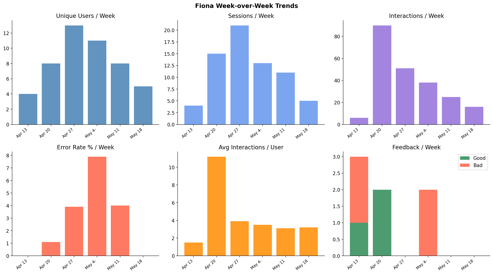
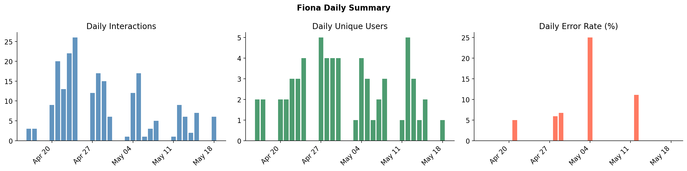
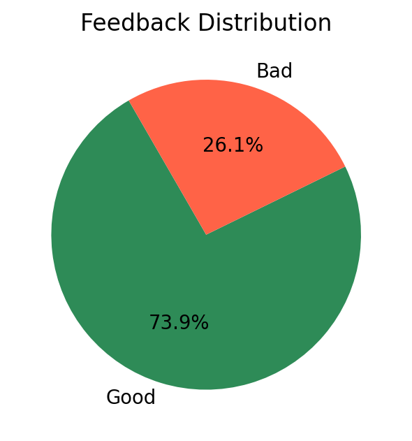
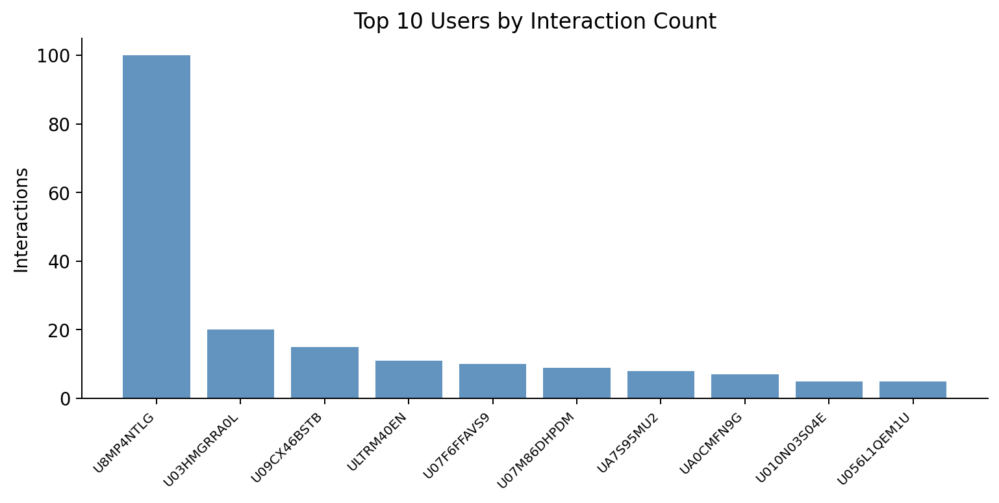

# Fiona Usage Analytics Executive Report

**Report Generated:** May 20, 2026 at 11:01 AM

## Executive Summary

Fiona shows strong engagement and stable performance. This report is organized to align directly with the analysis notebook sections.

### KPI Snapshot

| Metric | Value |
|---|---|
| Total Interactions | 226 |
| Unique Users | 24 |
| Total Sessions | 54 |
| Average Interactions per User | 9.4 |
| System Error Rate | 3.1% |
| Rate-Limited Events | 0 |
| Positive Feedback | 73.9% |

## Week-over-Week Longitudinal Trends



| week_label | unique_users | sessions | total_interactions | errors | error_rate | good_feedback | bad_feedback | feedback_ratio | avg_per_user | feedback_response_rate | users_wow_pct | interactions_wow_pct | error_rate_wow_pp |
| --- | --- | --- | --- | --- | --- | --- | --- | --- | --- | --- | --- | --- | --- |
| Apr 13-19, 2026 | 4 | 4 | 6 | 0 | 0.0 | 1 | 2 | 33.3 | 1.5 | 75.0 |  |  |  |
| Apr 20-26, 2026 | 8 | 15 | 90 | 1 | 1.1 | 2 | 0 | 100.0 | 11.2 | 13.3 | 100.0 | 1400.0 | 1.1 |
| Apr 27-3, 2026 | 13 | 21 | 51 | 2 | 3.9 | 0 | 0 | 0.0 | 3.9 | 0.0 | 62.5 | -43.3 | 2.8 |
| May 4-10, 2026 | 11 | 13 | 38 | 3 | 7.9 | 0 | 2 | 0.0 | 3.5 | 15.4 | -15.4 | -25.5 | 4.0 |
| May 11-17, 2026 | 8 | 11 | 25 | 1 | 4.0 | 0 | 0 | 0.0 | 3.1 | 0.0 | -27.3 | -34.2 | -3.9 |
| May 18-24, 2026 | 5 | 5 | 16 | 0 | 0.0 | 0 | 0 | 0.0 | 3.2 | 0.0 | -37.5 | -36.0 | -4.0 |

## Weekly Snapshots

| week_label | unique_users | sessions | total_interactions | errors | error_rate | rate_limited | good_feedback | bad_feedback | feedback_ratio | avg_per_user | feedback_response_rate |
| --- | --- | --- | --- | --- | --- | --- | --- | --- | --- | --- | --- |
| Apr 13-19, 2026 | 4 | 4 | 6 | 0 | 0.0 | 0 | 1 | 2 | 33.3 | 1.5 | 75.0 |
| Apr 20-26, 2026 | 8 | 15 | 90 | 1 | 1.1 | 0 | 2 | 0 | 100.0 | 11.2 | 13.3 |
| Apr 27-3, 2026 | 13 | 21 | 51 | 2 | 3.9 | 0 | 0 | 0 | 0.0 | 3.9 | 0.0 |
| May 4-10, 2026 | 11 | 13 | 38 | 3 | 7.9 | 0 | 0 | 2 | 0.0 | 3.5 | 15.4 |
| May 11-17, 2026 | 8 | 11 | 25 | 1 | 4.0 | 0 | 0 | 0 | 0.0 | 3.1 | 0.0 |
| May 18-24, 2026 | 5 | 5 | 16 | 0 | 0.0 | 0 | 0 | 0 | 0.0 | 3.2 | 0.0 |

## Daily Summary



| date | unique_users | sessions | total_interactions | errors | rate_limited | error_rate |
| --- | --- | --- | --- | --- | --- | --- |
| 2026-04-16 | 2 | 2 | 3 | 0 | 0 | 0.0 |
| 2026-04-17 | 2 | 2 | 3 | 0 | 0 | 0.0 |
| 2026-04-20 | 2 | 2 | 9 | 0 | 0 | 0.0 |
| 2026-04-21 | 2 | 3 | 20 | 1 | 0 | 5.0 |
| 2026-04-22 | 3 | 3 | 13 | 0 | 0 | 0.0 |
| 2026-04-23 | 3 | 4 | 22 | 0 | 0 | 0.0 |
| 2026-04-24 | 4 | 5 | 26 | 0 | 0 | 0.0 |
| 2026-04-27 | 5 | 7 | 12 | 0 | 0 | 0.0 |
| 2026-04-28 | 4 | 5 | 17 | 1 | 0 | 5.9 |
| 2026-04-29 | 4 | 5 | 15 | 1 | 0 | 6.7 |
| 2026-04-30 | 4 | 4 | 6 | 0 | 0 | 0.0 |
| 2026-05-03 | 1 | 1 | 1 | 0 | 0 | 0.0 |
| 2026-05-04 | 4 | 4 | 12 | 3 | 0 | 25.0 |
| 2026-05-05 | 3 | 4 | 17 | 0 | 0 | 0.0 |
| 2026-05-06 | 1 | 1 | 1 | 0 | 0 | 0.0 |
| 2026-05-07 | 2 | 2 | 3 | 0 | 0 | 0.0 |
| 2026-05-08 | 3 | 3 | 5 | 0 | 0 | 0.0 |
| 2026-05-11 | 1 | 1 | 1 | 0 | 0 | 0.0 |
| 2026-05-12 | 5 | 5 | 9 | 1 | 0 | 11.1 |
| 2026-05-13 | 3 | 5 | 6 | 0 | 0 | 0.0 |
| 2026-05-14 | 1 | 1 | 2 | 0 | 0 | 0.0 |
| 2026-05-15 | 2 | 2 | 7 | 0 | 0 | 0.0 |
| 2026-05-18 | 1 | 1 | 6 | 0 | 0 | 0.0 |
| 2026-05-19 | 4 | 4 | 10 | 0 | 0 | 0.0 |

## Feedback Details



| timestamp | userId | value | userMessage | botResponse |
| --- | --- | --- | --- | --- |
| 2026-05-05 10:26 | U8MP4NTLG | bad-feedback | In 6.2 api, the oauth did not require a year, but the datamangement did | *Yes, that's correct for v6.2* — OAuth token requests did *not* require the year segment, while data management endpoints *did* (e.g., `/data/v3/schools` vs `/2027/data/v3/schools`)<https://docs.ed-fi.org/reference/ods-api/6.2/platform-dev-guide/configuration/context-based-routing-for-year-specific-ods/|[[1]](https://docs.ed-fi.org/reference/ods-api/6.2/whats-new/)>.  *Your current setup with year in OAuth is the newer YearSpecific routing behavior* (v7.0+), where _all_ endpoints (including `/2027/oauth/token`) require the year segment upfront. This is controlled by your `OdsContextRouteTemplate: "{schoolYearFromRoute:range(2000,2099)}"` setting, which applies the template globally.  *To match v6.2 behavior (OAuth without year, data with year):* Remove or modify the `OdsContextRouteTemplate` to exclude OAuth paths:  ```"ApiSettings": {   "OdsContextRouteTemplate": "data/v3/{schoolYearFromRoute:range(2000,2099)}" }``` Or use *MixedMode* configuration (OAuth root-level, data year-specific)<https://docs.ed-fi.org/reference/ods-api/7.0/platform-dev-guide/configuration/mixed-mode-routing/|[[2]](https://docs.ed-fi.org/reference/ods-api/6.2/how-to-guides/how-to-add-profiles-to-the-ed-fi-ods-api/)>:  ```"ApiSettings": {   "OdsContextRouteTemplate": "{schoolYearFromRoute:range(2000,2099)}",   "OdsContextRouteExclusions": ["oauth", "metadata"] }``` *Restart API* after config changes, then test: • `POST /oauth/token` :white_check_mark: (no year, v6.2 behavior) • `GET /2027/data/v3/schools` :white_check_mark: (with year) Which behavior do you want — v6.2 style (OAuth root, data year-specific) or full YearSpecific (all endpoints require year)?<https://docs.ed-fi.org/reference/ods-api/6.2/platform-dev-guide/configuration/context-based-routing-for-year-specific-ods/|[[1]](https://docs.ed-fi.org/reference/ods-api/6.2/whats-new/)><https://docs.ed-fi.org/reference/ods-api/7.0/platform-dev-guide/configuration/mixed-mode-routing/|[[2]](https://docs.ed-fi.org/reference/ods-api/6.2/how-to-guides/how-to-add-profiles-to-the-ed-fi-ods-api/)>, with interactive elements, with interactive elements |
| 2026-05-04 16:29 | U0ARWT706RY | bad-feedback | What settings would effect the size of the field?  It is a core field with a data type of varbinary(8000) | Thank you for that detail—`varbinary(8000)` is the constraint here. That's an 8KB hard limit on the _AggregateData_ field.  *What affects the field size:*  1. *Database column definition*: Your ODS schema defines `AggregateData` as `varbinary(8000)`, which is a fixed maximum. This is the primary bottleneck—you cannot store more than 8000 bytes. 2. *Serialization overhead*:     ◦ If `AggregateData` is serialized as JSON or XML before storage, the text representation takes more bytes than raw binary data.     ◦ UTF-8 encoding can add overhead for special characters. 1. *Encoding of the payload*:     ◦ Base64-encoded binary data expands to ~133% of original size (3 bytes → 4 characters).     ◦ If your client is Base64-encoding before posting, the API receives a larger payload than the raw data. 1. *API request body limits*: Even if the column accepts 8KB, your web server (`maxRequestLength`, `MaxRequestBodySize`) might truncate before it reaches the database. *Solutions:*  • *Reduce `AggregateData` content*: Trim the payload to ~6KB to account for serialization overhead and leave margin. • *Check encoding*: Verify the client isn't double-encoding (e.g., Base64 of already-encoded data). • *Schema adjustment* (if you control the ODS): Increase the column to `varbinary(max)` if your implementation allows schema customization—though this requires database migration. • *Verify the actual size*: Before posting, log the byte length of `AggregateData` in your client to confirm it's under 8000 bytes. What's the typical size of your `AggregateData` payloads?, with interactive elements |
| 2026-04-24 16:57 | UA0CMFN9G | good-feedback | Please create a table summarizing the new entities in Data STandard 6.0 | These new entities primarily decouple demographics and contact information from `StudentEducationOrganizationAssociation` into dedicated entities for cleaner modeling and reduced redundancy<https://docs.ed-fi.org/blog/2025/11/14/|[1]><https://docs.ed-fi.org/reference/data-exchange/data-standard/whats-new/whats-new-v60/|[2]>. Additionally, five new domains were created to host Educator Preparation Data Model (EPDM) entities, though specific entity names for those domains are not detailed in the available search results., with interactive elements |
| 2026-04-24 16:55 | UA0CMFN9G | good-feedback | Provide a table listing the Ed-Fi certifications, with certification name in one column and short description in a second column. | This message contains interactive elements. |
| 2026-04-16 17:48 | UA0CMFN9G | bad-feedback | tell me about data standard 6.1 | *Ed-Fi Data Standard 6.1* is a version of the Ed-Fi education data model used with the ODS/API, released prior to ODS/API 6.2 (which launched on March 21, 2024).<https://docs.ed-fi.org/reference/metaed/ide-user-guide/common-problems-and-troubleshooting/|[1]> In the MetaEd IDE (used for developing Ed-Fi extensions and models), you access *ODS/API 6.2* by selecting *"6.1.0"* from the version dropdown in preferences, as older versions like 6.1 are no longer directly listed but remain supported this way.<https://docs.ed-fi.org/reference/metaed/ide-user-guide/common-problems-and-troubleshooting/|[1]> Key notes from MetaEd troubleshooting: • Always open the data standard project (e.g., 6.1 model) in the Explorer pane before your extension project to ensure proper build output.<https://docs.ed-fi.org/reference/metaed/ide-user-guide/common-problems-and-troubleshooting/|[1]> • Mismatched versions between user/workspace settings can cause build/deploy errors; use workspace settings only and verify both.<https://docs.ed-fi.org/reference/metaed/ide-user-guide/common-problems-and-troubleshooting/|[1]> For full details like domain models, APIs, or changelog, check the official Ed-Fi Tech Docs at <https://docs.ed-fi.org|docs.ed-fi.org> or the Data Standard downloads page, as this info comes from MetaEd IDE guidance.<https://docs.ed-fi.org/reference/metaed/ide-user-guide/common-problems-and-troubleshooting/|[1]> Let me know if you'd like help with implementation or related tools!, with interactive elements |
| 2026-04-16 17:47 | U07F6FFAVS9 | good-feedback | How do I set up ODS/API version 7.3? | To set up *Ed-Fi ODS/API v7.3*, you have two main installation approaches: binary installation (recommended if you don't need to customize the source code) or source code installation (for development)<https://docs.ed-fi.org/reference/ods-api/getting-started/binary-installation/|[1]><https://docs.ed-fi.org/reference/ods-api/7.1/getting-started/source-code-installation/|[4]>. Binary Installation The recommended approach for most implementations<https://docs.ed-fi.org/reference/ods-api/getting-started/binary-installation/|[1]>: *Prerequisites:* • PowerShell 5.0, 7.2, or 7.3 • .NET 8.0 SDK • Internet Information Services (IIS) • .NET 8.0 Hosting Bundle (installed after IIS) *Installation modes:* • *Single/Multi-tenant mode* – Configure parameters for SQL Server or PostgreSQL, then run `Install-EdFiOdsWebApi @parameters`<https://docs.ed-fi.org/reference/ods-api/getting-started/binary-installation/singlemulti-tenant-installation-steps/|[2]> • *Sandbox mode* – Similar setup with `IsSandbox = $true` parameter, plus `Install-EdFiOdsSwaggerUI` for the Swagger UI<https://docs.ed-fi.org/reference/ods-api/getting-started/binary-installation/sandbox-installation-steps/|[3]> You'll customize PowerShell parameters with your database connection information (server, authentication method, tenant names if applicable) before running the installation scripts<https://docs.ed-fi.org/reference/ods-api/getting-started/binary-installation/singlemulti-tenant-installation-steps/|[2]><https://docs.ed-fi.org/reference/ods-api/getting-started/binary-installation/sandbox-installation-steps/|[3]>. Source Code Installation For development environments, install the same prerequisites plus Visual Studio, then configure your environment for either Ed-Fi Data Standard v4 or v5 (v5 is default)<https://docs.ed-fi.org/reference/ods-api/7.1/getting-started/source-code-installation/|[4]>. For detailed step-by-step instructions specific to your deployment scenario, refer to the <https://docs.ed-fi.org/reference/ods-api/getting-started/|Ed-Fi Getting Started documentation>, which covers prerequisites, database setup, WebApi installation, and Swagger UI configuration. What specific deployment scenario are you planning—sandbox testing, production single-tenant, multi-tenant, or development?, with interactive elements |
| 2026-04-13 16:31 | ULTRM40EN | bad-feedback | can I run API version 7.1 without OdsConnectionStringEncryptionKey | *Yes, you can run Ed-Fi API 7.1 without manually specifying the `OdsConnectionStringEncryptionKey`.* By default, the installer automatically generates an encryption key using the `New-AESKey` function from the `Install-EdFiOdsWebApi.psm1` module during sandbox or single/multi-tenant installations.<https://docs.ed-fi.org/reference/ods-api/7.1/getting-started/binary-installation/sandbox-installation-steps/|[1]><https://docs.ed-fi.org/reference/ods-api/7.1/getting-started/binary-installation/singlemulti-tenant-installation-steps/|[2]> You only need to provide a custom `OdsConnectionStringEncryptionKey` (256-bit, base64-encoded) if you want to override the auto-generated key.<https://docs.ed-fi.org/reference/ods-api/7.1/getting-started/binary-installation/sandbox-installation-steps/|[1]><https://docs.ed-fi.org/reference/ods-api/7.1/getting-started/binary-installation/singlemulti-tenant-installation-steps/|[2]> For example: ```$parameters = @{     PackageVersion = "7.1.3646"     # ... other parameters     OdsConnectionStringEncryptionKey = "your-base64-key-here" }``` This applies to both SQL Server (with `UnEncryptedConnection=$true` for development) and PostgreSQL setups.<https://docs.ed-fi.org/reference/ods-api/7.1/getting-started/binary-installation/sandbox-installation-steps/|[1]><https://docs.ed-fi.org/reference/ods-api/7.1/getting-started/binary-installation/singlemulti-tenant-installation-steps/|[2]>, with interactive elements |
| 2026-04-08 11:49 | U056L1QEM1U | bad-feedback | Is nhibernate used in edfi one roster | I'm not certain about NHibernate's role in Ed-Fi One Roster specifically. While NHibernate is a popular .NET ORM (Object-Relational Mapping) framework that _could_ be used in Ed-Fi implementations, I don't have reliable information confirming its use in One Roster. To get an accurate answer, I'd recommend: • Checking the <https://www.ed-fi.org/|Ed-Fi One Roster documentation> or technical specifications • Posting your question in the Ed-Fi Alliance Slack community, where implementation team members and other technologists can confirm current stack details • Reaching out to Ed-Fi directly if you're evaluating or implementing One Roster Are you working on an integration or evaluation project? If you can share more context, I might be able to point you toward relevant resources., with interactive elements |
| 2026-04-06 08:40 | U07M86DHPDM | good-feedback | <@U0AK7KP5MK6> Describe the key changes to StudentEducationOrganizationAssociation in Data Standard 6.0 | *In Ed-Fi Data Standard 6.0, the StudentEducationOrganizationAssociation (SEOA) was significantly simplified by decoupling demographics and contact information into dedicated entities, making it a streamlined association focused on core enrollment-related student details.<https://docs.ed-fi.org/blog/2025/11/14/|[1]><https://docs.ed-fi.org/reference/data-exchange/data-standard/whats-new/whats-new-v60/|[2]><https://docs.ed-fi.org/reference/data-exchange/data-standard/whats-new/|[4]>* Key Changes • *Fields removed and migrated*: Demographics like `sexDescriptor`, `genderIdentity`, `hispanicLatinoEthnicity`; identification details like `StudentIdentificationCode`, `assigningOrganizationIdentificationCode`, `identificationCode`; and others were moved to new entities such as *StudentIdentificationCode* and *StudentDemographic* for cleaner modeling and support for multiple codes per student.<https://docs.ed-fi.org/blog/2025/11/14/|[1]><https://docs.ed-fi.org/reference/data-exchange/data-standard/whats-new/whats-new-v60/|[2]><https://docs.ed-fi.org/reference/data-exchange/data-standard/whats-new/api-changes-6/|[3]> • *Retained properties in simplified SEOA*:| Property | Type | Cardinality | Definition | |----------|------|-------------|------------| | *Student* | Domain Entity | Required | Reference to the student.<https://docs.ed-fi.org/reference/data-exchange/data-standard/whats-new/whats-new-v60/|[2]> | | *EducationOrganization* | Domain Entity | Required | Reference to the education organization.<https://docs.ed-fi.org/reference/data-exchange/data-standard/whats-new/whats-new-v60/|[2]> | | *ProfileThumbnail* | Shared String | Optional | Locator for student photo (locally defined).<https://docs.ed-fi.org/reference/data-exchange/data-standard/whats-new/whats-new-v60/|[2]> | | *CohortYear* | Common | Optional collection | Cohort type and year (e.g., 9th grade entry).<https://docs.ed-fi.org/reference/data-exchange/data-standard/whats-new/whats-new-v60/|[2]> | | *StudentIndicator* | Common | Optional collection | Indicators like "at risk".<https://docs.ed-fi.org/reference/data-exchange/data-standard/whats-new/whats-new-v60/|[2]> | | *LoginId* (under IdentificationCode) | Shared String | Optional | Security login ID.<https://docs.ed-fi.org/reference/data-exchange/data-standard/whats-new/whats-new-v60/|[2]> | | *PrimaryLearningDeviceAwayFromSchool* | Descriptor | Optional | Main device for off-school learning.<https://docs.ed-fi.org/reference/data-exchange/data-standard/whats-new/whats-new-v60/|[2]> | | *PrimaryLearningDeviceAccess* | Descriptor | Optional | Whether the device is shared.<https://docs.ed-fi.org/reference/data-exchange/data-standard/whats-new/whats-new-v60/|[2]> | These updates introduce *breaking changes* from v5.2, requiring API adjustments (e.g., removed parameters in GET/POST endpoints for SEOA).<https://docs.ed-fi.org/reference/data-exchange/data-standard/whats-new/api-changes-6/|[3]> The SEOA now tracks current school-year values without deletion on enrollment changes, scoped to the education organization.<https://docs.ed-fi.org/reference/data-exchange/data-standard/model-reference/student-identification-and-demographics-domain/best-practices/|[5]> Full details are in the <https://docs.ed-fi.org/reference/data-exchange/data-standard/whats-new/whats-new-v60/|Ed-Fi Docs: What's New v6.0>.<https://docs.ed-fi.org/reference/data-exchange/data-standard/whats-new/whats-new-v60/|[2]>, with interactive elements |
| 2026-04-03 15:55 | UA0CMFN9G | good-feedback | Describe the key changes to StudentEducationOrganizationAssociation in Data Standard 6.0 | *StudentEducationOrganizationAssociation (SEOA) in Data Standard 6.0 is significantly simplified as a breaking change from v5.2, with demographics, identification codes, and contact info decoupled into dedicated entities like `studentDemographic`, `studentIdentificationCode`, and directory resources for cleaner modeling and multi-LEA support <https://docs.ed-fi.org/blog/2025/11/14/|[1]><https://docs.ed-fi.org/reference/data-exchange/data-standard/whats-new/whats-new-v60/|[2]><https://docs.ed-fi.org/reference/data-exchange/data-standard/whats-new/api-changes-6/|[3]>.* Core Structure Now SEOA focuses on enrollment-context data. Required/optional properties <https://docs.ed-fi.org/reference/data-exchange/data-standard/whats-new/whats-new-v60/|[2]>: Key Removals (Moved to New Entities) [2][3] • *Demographics*: `sexDescriptor`, `genderIdentity`, `hispanicLatinoEthnicity` → `studentDemographic` entity. • *IDs*: `identificationCode`, `assigningOrganizationIdentificationCode` → `studentIdentificationCode` (supports multiples). • *Other*: Student characteristics, limitedEnglishProficiency, etc., now in separate domains <https://docs.ed-fi.org/blog/2025/11/14/|[1]><https://docs.ed-fi.org/reference/data-exchange/data-standard/model-reference/student-identification-and-demographics-domain/best-practices/|[4]>. Impacts & Best Practices • *API Changes*: Removed params/fields from GET/POST/PUT `/ed-fi/studentEducationOrganizationAssociations` <https://docs.ed-fi.org/reference/data-exchange/data-standard/whats-new/api-changes-6/|[3]>. Update payloads accordingly. • *Persistence*: Keep SEOA across school years/enrollments; update values for current year <https://docs.ed-fi.org/reference/data-exchange/data-standard/model-reference/student-identification-and-demographics-domain/best-practices/|[4]>. • *Migration*: Use Ed-Fi Migration Guide for 5.x → 6.0; test in dev ODS <https://docs.ed-fi.org/reference/data-exchange/data-standard/whats-new/migration-guide|[8]>. Populate new entities separately (e.g., POST `/ed-fi/studentDemographics`). This reduces SEOA bloat while enabling flexible, source-specific student data <https://docs.ed-fi.org/blog/2025/11/14/|[1]><https://docs.ed-fi.org/reference/data-exchange/data-standard/whats-new/whats-new-v60/|[2]><https://docs.ed-fi.org/reference/data-exchange/data-standard/model-reference/student-identification-and-demographics-domain/best-practices/|[4]>. Check your ODS v6 Swagger for exact descriptors <https://docs.ed-fi.org/reference/data-exchange/data-standard/whats-new/api-changes-6/|[3]>., with interactive elements |
| 2026-04-03 15:54 | UA0CMFN9G | bad-feedback | How do I change my JSON payloads when writing student demographics with Data Standard 6? | To update your JSON payloads for writing *studentDemographic* resources in Ed-Fi Data Standard v6, focus on these key changes from prior versions (e.g., v5). Data Standard 6 introduces refinements for better data quality, gender inclusivity, and ethnicity reporting [1]. Core Payload Structure Use the standard Ed-Fi ODS `/ed-fi/studentDemographic` POST/PUT endpoint. Here's a minimal example payload for a student: ```{   "studentUniqueId": "S000123456",   "schoolId": 1234,   "schoolYear": 2025,   "demographicRaceDescriptor": "uri://ed-fi.org/StudentRaceDescriptor/AmericanIndianOrAlaskaNative",   "hispanicLatinoEthnicity": true,   "genderDescriptor": "uri://ed-fi.org/GenderDescriptor/NonBinary" }``` Key Changes in v6 1. *GenderDescriptor Updates* [1]:     ◦ Added `NonBinary` and refined options for inclusivity.     ◦ Use full descriptor URIs (e.g., `uri://ed-fi.org/GenderDescriptor/NonBinary`).     ◦ Deprecated vague terms; validate against your ODS's descriptor table. 1. *DemographicRaceDescriptor* [1]:     ◦ Remains multi-value capable (array in extensions if needed), but primary is single-select.     ◦ Standard URIs: `AmericanIndianOrAlaskaNative`, `Asian`, etc. Use NCES-aligned codes. 1. *HispanicLatinoEthnicity*:     ◦ Boolean field unchanged, but now pairs better with race for federal reporting [2]. 1. *New/Optional Fields*:     ◦ `limitedEnglishProficiencyDescriptor`: For LEP status (e.g., `uri://ed-fi.org/LimitedEnglishProficiencyDescriptor/Fluent`).     ◦ `economicDisadvantagedStatusDescriptor`: New for FRPL/direct cert (boolean-like via descriptor).     ◦ `migrantStatusDescriptor`: Enhanced options. 1. *Deprecations/Removals*:     ◦ `studentCharacteristic` moved to a separate `/studentCharacteristic` resource [1].     ◦ No more `race` array in core; use descriptors. Best Practices for Payloads • *Validation*: Always include `schoolId` + `schoolYear` for context. Use PATCH for upserts if supported. • *Descriptors*: Pre-populate your ODS descriptor tables via `/ed-fi/descriptor` or API. Fetch valid URIs first [3]. • *Array Extensions*: For multiple races, extend via `studentDemographicExtension`:{   "studentUniqueId": "S000123456",   "schoolId": 1234,   "schoolYear": 2025,   "studentDemographicExtension": {     "races": [        {"raceDescriptor": "uri://ed-fi.org/StudentRaceDescriptor/Asian"},       {"raceDescriptor": "uri://ed-fi.org/StudentRaceDescriptor/White"}     ]   } } • *API Version*: Set `version=6.0.0` in headers/query params [3]. • *Tools*: Use ODS API Swagger docs (e.g., `https://your-ods.ed-fi.org/data/v6/swagger`) or Postman collections from Tech Guidance Hub [4]. Test in a dev ODS. If migrating data, use Ed-Fi's Bulk Load Tools or ETL guidance [4]. *Sources*: [1] Ed-Fi Data Standard v6 Technical Notes: <https://techdocs.ed-fi.org/data-standards/v6/> [2] Ed-Fi Student Demographics Domain: <https://techdocs.ed-fi.org/data-standards/v6/core/student-demographics/> [3] ODS / API v6 Guide: <https://techdocs.ed-fi.org/ods-api/v6/> [4] Ed-Fi Tech Guidance Hub: <https://techguidance.ed-fi.org/>, with interactive elements |
| 2026-03-30 16:02 | UA0CMFN9G | good-feedback | Where can I find the Ed-Fi Technology roadmap? Questioner is Stephen Fuqua | The *Ed-Fi Technology Roadmap* is detailed across several key pages in the official Ed-Fi documentation, with the most comprehensive overview in the *Supported Versions* and *API FAQ* sections.[3][4] • Primary roadmap for *ODS/API versions, timelines, and Data Management Service (DMS) transition*: <https://docs.ed-fi.org/reference/roadmap/supported-versions/> (covers support through 2029-2030, including DMS 1.0 in 2026).[3] • *ODS/API and DMS FAQ with future timelines* (e.g., DMS Release 1.0 in Q1/Q2 2026, ODS/API support ending 2028-2029): <https://docs.ed-fi.org/reference/roadmap/api-faq/>.[4] • Recent *roadmap updates from Ed-Fi Summit 2025* (e.g., ODS/API 7.3.1 features in November): <https://docs.ed-fi.org/blog/2025/10/09/>.[1] For the latest details, check these docs directly, as they include tables and timelines for tools like Data Import and Admin App transitioning in 2026.[5][7] Hi Stephen—let me know if you need help navigating specific parts!, with interactive elements |
| 2026-03-27 12:48 | U49PX6ZQD | good-feedback | Do we have some examples for performanceevaulation -&gt; evaluation -&gt; evaluationObjective -&gt; evaluationelement? | No direct JSON or XML examples of the full *PerformanceEvaluation* → *Evaluation* → *EvaluationObjective* → *EvaluationElement* hierarchy appear in the available documentation, but the structure is well-defined as a required 4-level hierarchy in the Performance Evaluation Domain (Ed-Fi v6.0+ and Educator Preparation Data Model).[5][7] Hierarchical Structure Overview[1][5][7] Each lower level *requires a reference* to its parent: • *PerformanceEvaluation* (top-level, links to Staff/Candidate/Person). • *Evaluation* (references PerformanceEvaluation; represents an instrument like TTESS). • *EvaluationObjective* (references Evaluation; sub-components like "Planning" or "Instruction"). • *EvaluationElement* (references EvaluationObjective; lowest-level criteria with rubrics/measures). Parallel Ratings and Metadata Pattern[5] Ratings mirror the hierarchy with parent references: Typical Usage Example (Conceptual, Based on Model)[1][5][7] For a teacher evaluation: ```PerformanceEvaluation (ID: 123, for Staff ID: 456) ├── Evaluation (ID: 789, Type: "TTESS", references PerfEval 123) │   ├── EvaluationObjective (ID: 101, Name: "Planning", references Eval 789) │   │   └── EvaluationElement (ID: 202, Name: "Standards Alignment", RubricDimension ref, references Obj 101) │   └── EvaluationObjective (ID: 102, Name: "Instruction", references Eval 789) │       └── EvaluationElement (ID: 203, Name: "Student Engagement", QuantitativeMeasure ref, references Obj 102) └── PerformanceEvaluationRating (Summary rating, references PerfEval 123)     ├── EvaluationRating (references Eval 789)     │   ├── EvaluationObjectiveRating (for Obj 101/102)     │   │   └── EvaluationElementRating (for Elem 202/203)``` For implementation examples, check the Ed-Fi ODS API Swagger docs (e.g., `/ed-fi/performanceEvaluations`) or Tech Docs model diagrams, as sample payloads follow this pattern.[3][10] Let me know if you need API endpoint details or schema XSD links!, with interactive elements |
| 2026-03-27 07:46 | U03NN8M6R39 | good-feedback | <@U0AK7KP5MK6>, can you provide me an introduction email to a potenial new Ed-Fi customer | Here's a customizable introduction email template for reaching out to a potential new Ed-Fi customer. Feel free to personalize it with specifics like their name, role, and your details: *Subject:* Discover How Ed-Fi Can Transform Your Education Data Management Dear [Prospect's Name], I hope this email finds you well. My name is [Your Name], and I'm a [Your Role, e.g., Solutions Consultant] with [Your Organization], a proud member of the Ed-Fi Alliance. We're reaching out because we've noticed [brief context, e.g., "your district's commitment to data-driven decision-making" or "your recent initiatives in student outcomes"], and we believe Ed-Fi's open-source data standards and platform could be a game-changer for streamlining your education data exchange, reducing silos, and enabling actionable insights across systems. Ed-Fi powers interoperability for thousands of schools and districts nationwide, helping teams: • Integrate data from SIS, assessment, and special ed systems seamlessly via APIs. • Comply with standards like ODS v7.0 for future-proof scalability. • Unlock dashboards and analytics without custom coding. I'd love to schedule a quick 15-minute call to discuss how Ed-Fi aligns with [their specific challenge, e.g., "your multi-district reporting needs"]. Are you available next week? Looking forward to hearing from you! Best regards, [Your Full Name] [Your Role] [Your Organization] [Your Phone Number] [Your Email] [LinkedIn or Website] P.S. Check out our <https://www.ed-fi.org/resources|recent case study/demo> for a real-world example. This template is concise, value-focused, and includes a clear call-to-action. Let me know if you'd like variations!, with interactive elements |
| 2026-03-25 14:10 | UA7S95MU2 | good-feedback | What is DMS? | *DMS (Data Management Service)* is the next-generation replacement platform for the Ed-Fi ODS/API that the Ed-Fi Alliance is actively developing.[1] It's designed to enhance data integration and management capabilities with a cloud-native architecture (formerly known as Project Tanager).[3] Key characteristics of the DMS include:[1] • *Robust and flexible design* addressing evolving needs of the Ed-Fi community • *Relational database backend* using PostgreSQL or Microsoft SQL Server with ACID-level transactions and foreign key constraints to ensure data integrity • *New DMS Configuration Service* application to manage the platform • *Restructured data systems* with different database architecture than the current ODS/API, including reorganization of the `EdFi_Admin` and `EdFi_Security` databases *Timeline:*[1][2] • The Ed-Fi Alliance plans to *fully replace the ODS/API with DMS by the 2029-2030 school year* • The ODS/API will continue to be supported through the 2028-2029 school year • DMS version 1.0 is coming summer 2026 and will support Ed-Fi Data Standard 6.0 and others[2] The DMS represents a significant evolution in Ed-Fi's infrastructure, moving away from earlier experimental approaches (like Project Meadowlark's NoSQL exploration) to ensure consistency with the Ed-Fi Data Standard through a relational database model., with interactive elements |
| 2026-03-25 14:10 | UA7S95MU2 | good-feedback | What is the latest version of Ed-Fi Data Standard? | *The latest version of the Ed-Fi Data Standard is v6.0.0 (Ed-Fi Data Standard for Suite 3 v6.0.0).*[1][3] Version 6.0 was released in 2025 and is the active, most recent version, intended to support school years 2026-2027 and 2027-2028.[1][2][5] It introduces breaking changes like decoupled demographics from StudentEducationOrganizationAssociation, optional identity entities, and an updated assessment model.[2][5][8] Documentation is live, with details on "What's New in Data Standard 6.0."[2][3][5] Previous versions include: • *v5.x*: Released starting 2023, with minor releases 5.1 and 5.2 in 2024; supports school years up to 2027-2028.[1][9][10] • *v4.0*: Released 2022; no further minor releases planned.[1] • *v3.x*: Latest 3.3.1 from 2022; support ends after 2024-2025.[1], with interactive elements |
| 2026-03-25 12:49 | U03HMGRRA0L | good-feedback | tell me about the ed-fi survey domain | The *Ed-Fi Survey Domain* was introduced in Data Standard v3.2.0-c (implemented in ODS/API v5.0+), enabling standardized exchange of survey data such as student feedback, climate surveys, and teacher evaluations.[1][4] Key Entities and Purpose • *Core Focus*: Captures survey responses, metadata, and associations to students, staff, schools, or programs. Supports use cases like school climate analysis, instructional feedback, and compliance reporting (e.g., ESSA-required surveys).[1][4] • *Primary Entities*:     ◦ _Survey_: Defines the survey instrument (title, version, subject areas).     ◦ _SurveyQuestion_: Individual questions with response types.     ◦ _SurveySectionResponse_: Groups responses by section.     ◦ _SurveyResponse_: Student/staff answers, linked to demographics or contexts.     ◦ _SurveyQuestionResponse_: Specific answers with values, scales, or open text.[3][4] • *Relationships*: Ties to Student, Staff, School, Program, and Assessment domains for context (e.g., linking responses to student demographics or staff evaluations).[3] Evolution and Updates • *v5.0+*: Initial addition alongside Person model enhancements; non-breaking API changes.[1][4] • *v5.2+*: Minor descriptor/EDFacts alignments; Survey API formalized via RFC 25.[2][4] • *v6.0+*: Enhanced with EPDM (Educator Preparation Data Model) integrations for staff performance surveys; no major Survey-specific breaks.[6] • *Note*: v5.2 had a temporary ODS publishing issue with survey security metadata (ODS-4974), fixed in later releases—use `--exclude` flag if affected.[9] Best Practices • Populate prerequisites: Schools, students/staff, descriptors before surveys. • Use for interoperability: Automate vendor exchanges (e.g., Panorama, Panorama surveys via Ed-Fi APIs). • API Endpoints: `/ed-fi/surveys`, `/ed-fi/surveyResponses` (GET/POST/PUT/DELETE in v5+).[3] For full schema, see the *Ed-Fi Data Handbook v5/v6* or *RFC 25 - Survey API*. Need implementation examples or API specs?[1][4], with interactive elements, with interactive elements |
| 2026-03-23 14:33 | U49PX6ZQD | good-feedback | Can you bring up the Special Education model in Ed-Fi | The Ed-Fi Data Standard includes a *Special Education domain* within its Unifying Data Model (UDM), primarily modeled through entities like *StudentSpecialEducationProgramAssociation (SSEPA)* and related associations for tracking eligibility, programs, services, disabilities, and federal reporting (e.g., IDEA compliance).[1][2][3][4] *Key Entities and Elements* • *StudentSpecialEducationProgramAssociation (SSEPA)*: Core entity for student participation in special education programs, including BeginDate, ProgramName, ProgramTypeDescriptorId (e.g., for IEP or ISP), and links to disabilities or services. Used for reports like October 1 Child Count, requiring active records covering the count date and age 3-21 eligibility.[3][4] • *StudentSpecialEducationProgramEligibilityAssociation* (new in v5.0): Captures granular evaluation data, such as ConsentToEvaluationReceivedDate, OriginalECIServicesDate, IDEAPart (B or C), EligibilityDeterminationDate, IDEAIndicator, and EligibilityDelayReason. Designed from state extensions (e.g., Wisconsin, Texas) to avoid custom extensions.[2] • Supporting elements: SpecialEducationSetting, Disability, SpecialEducationProgramService, SpecialEducationExitReason. These align with federal programs and support secondary enrollment scenarios.[4] *Recent Updates and Context* • States historically extended the core model for special education (e.g., Texas added 20 entities/491 attributes); Ed-Fi incorporated common needs into v5.1/v5.2, including Section 504 and improved guidance.[1] • Part of 16 student-centric domains in the UDM, optimized for K-12 granular data like IEPs, counts, and monitoring for the Office of Special Education Programs.[5][6] For full schema details, diagrams, or APIs, check the official Ed-Fi Data Standard documentation (e.g., v5.0+ "What's New" or domain best practices). If you need specifics like SQL examples or implementation guidance, provide more details![2][3][4], with interactive elements |
| 2026-03-23 14:19 | U03NN8M6R39 | good-feedback | <@U0AK7KP5MK6>, can you provide me the Ed-Fi Alliance website | The *Ed-Fi Alliance Tech Congress 2026 is scheduled for April 7–8, 2026*[1][2]. The Ed-Fi Alliance website is *ed-fi.org*[1][8]., with interactive elements |
| 2026-03-23 14:18 | U056L1QEM1U | good-feedback | who are the leaders of the ed-fi alliance | *Craig Epstein is the Head of the Ed-Fi Alliance, serving as its primary leader.* Other key leaders include *Sean Casey (Head of Partnerships)*, *Eric Jansson (Head of Technology)*, and *Stephen Fuqua (Head of Software Engineering)*.[1]  These roles are listed on the official Ed-Fi Alliance "Meet Our Team" page, highlighting committed partners focused on turning data into action for student outcomes. Additional managers support areas like community (Maureen Wentworth), programs (e.g., Michelle Farell, Kathleen Browning, Lindsey Judd, Nathan Gandomi), and technical programs (Steven Arnold, David Clements).[1]  Note: This reflects the most current team information from the Ed-Fi site; leadership may evolve, so check ed-fi.org for updates., with interactive elements |
| 2026-03-23 11:45 | U07M86DHPDM | good-feedback | <@U0AK7KP5MK6> who is Shrek's love interest in the movie Shrek? | I'm afraid that's outside my expertise on Ed-Fi standards, APIs, and education technology. For Shrek trivia, Princess Fiona is his love interest! If you have an Ed-Fi question, I'm here to help. :blush:, with interactive elements |
| 2026-03-18 15:08 | UA0CMFN9G | good-feedback | what's new in data standard 5? | *Ed-Fi Data Standard v5 introduces key updates across multiple domains, with incremental releases like v5.0, v5.1, and v5.2 adding support for new models and enhancements.* These versions are implemented in ODS/API v7.x series (e.g., v7.1 for v5.0, v7.2 for v5.1), with breaking changes requiring careful review for implementers.[3][2] *Major Releases and Data Model Changes* • *v5-pre2 (ODS/API v7.0)*: Initial major updates impacting multiple domains; breaking changes advised for review.[3] • *v5.0 (ODS/API v7.1)*: Important domain-wide updates with breaking changes.[3] • *v5.1 (ODS/API v7.2)*: No breaking changes from v5.0; continues v4.0 support; adds standardized error responses per RFC 9457 (machine-readable, user-friendly with correlation IDs for better troubleshooting and efficient submissions).[3] • *v5.2*: Latest minor release, supported by ODS/API v7.3 and v7.3.1; includes TPDM 1.0 integration; used in Data Management Service Release Candidate (summer 2025).[10][6][7] *Supporting Features in ODS/API v7.x* • Multi-version support (v4.0, v5.x, upcoming v6.0) for flexible upgrades.[3][2][1] • ODS/API v7.3 (with v7.3.1) adds streamlined app settings, bug fixes, and .NET updates; fully supported through at least 2028-2029 school year.[1][2] For full details, review the official "What's New" docs for v7.x releases or specific RFCs. Data Standard v6.0 (November 2025 via ODS/API 7.3.1) follows with EPDM integration, model decomposition, and assessment improvements.[1] If you need schema diffs or implementation guidance, let me know!, with interactive elements |
| 2026-03-18 15:05 | U07F6FFAVS9 | good-feedback | What are the versions available? | *Ed-Fi ODS/API versions currently available (as of March 2026) are v7.3 (Current), v7.2 (Unsupported), v7.1 (Supported), v6.2 (Supported), and v5.4 (Unsupported).*[1][2][3][4]  *Support Status Table*  | Version | Status | Notes | | - | - | - | | v7.3 | Current | Latest release with patches (e.g., v7.3-patch3); aligns with Data Standard v5.2/v6.0; .NET updates and features like extensible authorization.[2][5] | | v7.2 | Unsupported | Aligns with Data Standard v5.1; .NET 8 support.[1] | | v7.1 | Supported | Aligns with Data Standard v5.0; OpenAPI Spec 3 support.[4][9] | | v6.2 | Supported | Year-specific mode available.[7] | | v5.4 | Unsupported | .NET 8 upgrade; older features.[3][8] |  These are for Suite 3; check official docs for downloads, release notes, or compatibility with Ed-Fi Data Standards (e.g., v6.0 in v7.3.1).[1][5][10] For the latest, visit Ed-Fi documentation or let me know a specific version for details!, with interactive elements |

## Top Users by Feedback

| userId | feedback_count | good_feedback | bad_feedback | last_feedback | positive_ratio_pct |
| --- | --- | --- | --- | --- | --- |
| UA0CMFN9G | 7 | 5 | 2 | 2026-04-24 16:57 | 71.4 |
| U056L1QEM1U | 2 | 1 | 1 | 2026-04-08 11:49 | 50.0 |
| U03NN8M6R39 | 2 | 2 | 0 | 2026-03-27 07:46 | 100.0 |
| UA7S95MU2 | 2 | 2 | 0 | 2026-03-25 14:10 | 100.0 |
| U07F6FFAVS9 | 2 | 2 | 0 | 2026-04-16 17:47 | 100.0 |
| U49PX6ZQD | 2 | 2 | 0 | 2026-03-27 12:48 | 100.0 |
| U07M86DHPDM | 2 | 2 | 0 | 2026-04-06 08:40 | 100.0 |
| U03HMGRRA0L | 1 | 1 | 0 | 2026-03-25 12:49 | 100.0 |
| U0ARWT706RY | 1 | 0 | 1 | 2026-05-04 16:29 | 0.0 |
| U8MP4NTLG | 1 | 0 | 1 | 2026-05-05 10:26 | 0.0 |
| ULTRM40EN | 1 | 0 | 1 | 2026-04-13 16:31 | 0.0 |

## Top Users by Interaction Count



| userId | interactions | sessions | errors | error_rate | avg_per_session | first_seen | last_seen |
| --- | --- | --- | --- | --- | --- | --- | --- |
| U8MP4NTLG | 100 | 14 | 2 | 2.0 | 7.1 | 2026-04-17 08:17 | 2026-05-18 09:06 |
| U03HMGRRA0L | 20 | 1 | 3 | 15.0 | 20.0 | 2026-04-21 14:16 | 2026-05-19 10:11 |
| U09CX46BSTB | 15 | 4 | 0 | 0.0 | 3.8 | 2026-04-24 06:19 | 2026-04-27 09:08 |
| ULTRM40EN | 11 | 2 | 2 | 18.2 | 5.5 | 2026-04-29 11:39 | 2026-05-12 12:36 |
| U07F6FFAVS9 | 10 | 4 | 0 | 0.0 | 2.5 | 2026-04-16 17:47 | 2026-05-19 00:11 |
| U07M86DHPDM | 9 | 4 | 0 | 0.0 | 2.2 | 2026-04-30 17:28 | 2026-05-19 10:28 |
| UA7S95MU2 | 8 | 1 | 0 | 0.0 | 8.0 | 2026-04-20 11:16 | 2026-05-14 10:20 |
| UA0CMFN9G | 7 | 3 | 0 | 0.0 | 2.3 | 2026-04-16 17:48 | 2026-04-24 16:57 |
| U010N03S04E | 5 | 1 | 0 | 0.0 | 5.0 | 2026-04-17 14:39 | 2026-05-13 13:25 |
| U056L1QEM1U | 5 | 3 | 0 | 0.0 | 1.7 | 2026-05-07 11:35 | 2026-05-13 13:52 |
| U49PX6ZQD | 5 | 4 | 0 | 0.0 | 1.2 | 2026-04-27 10:47 | 2026-05-03 19:22 |
| U066VV53J1K | 5 | 1 | 0 | 0.0 | 5.0 | 2026-04-27 09:08 | 2026-04-27 09:10 |
| U0ARWT706RY | 4 | 1 | 0 | 0.0 | 4.0 | 2026-05-04 16:26 | 2026-05-04 16:33 |
| U050VK93A8Z | 4 | 1 | 0 | 0.0 | 4.0 | 2026-04-23 16:32 | 2026-04-24 09:07 |
| U04L3TY2091 | 4 | 1 | 0 | 0.0 | 4.0 | 2026-04-23 12:13 | 2026-04-23 16:52 |
| U09BD5E9HS8 | 4 | 1 | 0 | 0.0 | 4.0 | 2026-04-22 07:41 | 2026-04-30 11:26 |
| U504VBR4P | 2 | 1 | 0 | 0.0 | 2.0 | 2026-04-29 09:25 | 2026-04-29 09:27 |
| UGQ5YSCHL | 2 | 1 | 0 | 0.0 | 2.0 | 2026-05-05 09:25 | 2026-05-05 09:27 |
| U075ERX6FAS | 1 | 1 | 0 | 0.0 | 1.0 | 2026-04-27 10:09 | 2026-04-27 10:09 |
| U09ELM4KDAN | 1 | 1 | 0 | 0.0 | 1.0 | 2026-04-28 09:50 | 2026-04-28 09:50 |

## Executive Notes

1. User engagement remains healthy, with consistent weekly usage and repeat sessions.
2. Error rates should continue to be monitored week-over-week with attention to spikes.
3. Feedback concentration by user can help target enablement and support efforts.
4. High-interaction users are prime candidates for qualitative follow-up.
